## Installation

Copy the `.github`, `assets`, and `scripts` folders into the repository named `Niyants101/Niyants101`. Then copy the image block above into that repository's main `README.md`.

Open the repository's Actions tab, choose **Update Night Shift**, and select **Run workflow** once. After that, the scene refreshes automatically each day.

If GitHub Actions asks for permission, open repository **Settings**, then **Actions**, then **General**, choose **Read and write permissions**, and save.
